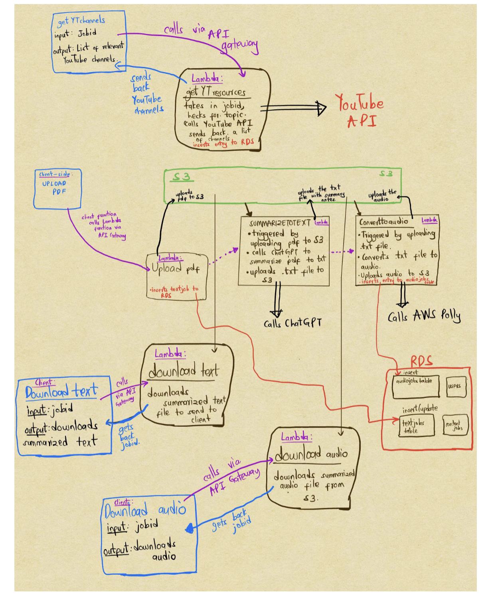

# Visually-Accessible Study Partner App

## Introduction and Project Overview
Students with visual impairments often struggle to study long, text-heavy PDFs, especially in academic settings where materials are extensive and dense.

This application comes up with a solution to this by providing a *Study Partner Guide* for these students where they can upload their long PDFs and get study aids like:

    - Concise text summaries for faster reading
    - audio versions of summaries that they can listen to as they go about their day
    - links to relevant YouTube videos where they can get more information on the subject.

## Description of Tools
This is an image of the project architecture and its components:

## Major Design Decisions
1. Event-Driven versus Synchronous 

*Decision*: Use S3-event-triggered Lambda functions instead of a single synchronous API call. Once the user uploads a pdf, it triggers the text processing service and audio covnersion service asynchronously.

*Pros*:
    - the upload process is significantly faster since we don't have to wait for text processing to happen (which may take some time)
    - decoupling of components such that file uplaod service availability can still occur even if any part of the processing pipeline fails
    - significantly faster latency from the user's point of view for audio conversion since it is pre-processed beforehand

*Cons*:
    - limited flexibility in terms of customizing how you want different files processed i.e maybe different voice tones for different files

2. Microservices (Lambda functions) versus Monolithic service

*Decision*: Split the pipeline into multiple Lambda functions, each responsible for a single stage (upload, summarization, audio conversion).

*Pros*:
    - smaller blast radius in case of updates
    - separation of concerns: more maintainable and easier to test separate services
    - isolation of services thus ensuring fault tolerance even if one service fails
    - different services need different dependencies 

*Cons*:
    - Introduces additional coordination and operational complexity compared to a monolithic service
    - Requires explicit state management and cross-service observability to debug failures

3. Serverless versus Serverful Architecture

*Decision*: Chose a serverless architecture using AWS Lambda instead of managing a long-running backend server.

*Pros*: 
    - no idle infrastructure since most tasks are bursty and event-driven
    - automatic server scaling for large file processing
    - more cost-efficient pay-as-you-use model instead of renting a server for some period of time

*Cons*:
    - higher cold-start latency for each request
    - execution limits per service

## AWS Tooling
- AWS S3: Object storage for uploaded PDFs, generated summaries, and audio files. S3 event notifications to trigger downstream Lambda functions.
- AWS Lambda: Serverless compute used to implement backend services for PDF ingestion, text summarization, and audio generation
- AWS RDS (**SQL**): Relational database used to track users, job metadata, processing status, and file references
- AWS Polly: Text-to-speech service used to convert generated summaries into audio (MP3) format
- AWS API Gateway: Handles HTTP request routing, request validation, and throttling for user-facing upload APIs. Provides a clean interface between clients and backend Lambdas.
- AWS IAM: Used to manage permissions for Lambda functions to access S3, RDS, and Polly
- AWS CloudWatch: Used for logging and monitoring Lambda executions, debugging failures
- AWS Lambda Layers: Used to package shared dependencies (e.g., PDF parsing libraries and ChatGPT API library) 

## Room for Growth
1. Accessible UI
Given more time I would like to develop an accessible UX interface with things like screen readers and progress indicators enabled for more support for visually imapiread users

2. Personalization
Allow users to indicate how they want their files summarized i.e giving the option to select the voice tone when converting to audio etc.

## Reproducing the project
The repository includes:
- Lambda function source code
- Lambda layers
- Client-side code
These components can be reused to recreate the pipeline in another AWS environment

## Running the code
- Ensure an AWS account is configured with access to S3, Lambda, RDS, and Polly
- Create a Python virtual environment
- Install dependencies from requirements.txt
- Run main.py (entry point)

